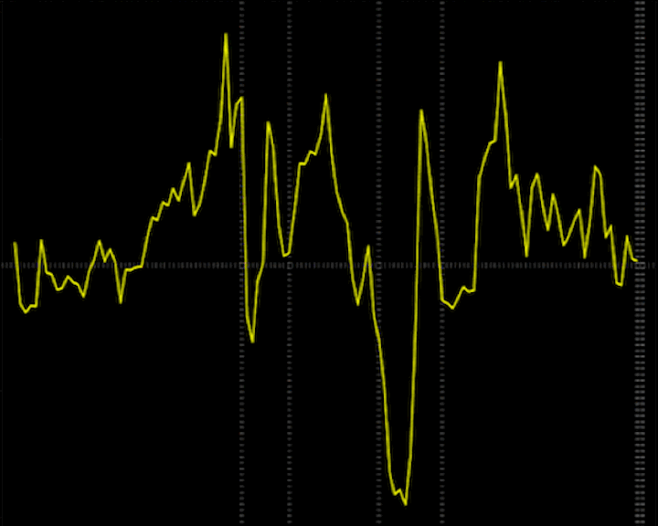

<!-- Main -->

<!-- Two -->
<section id="two" class="spotlights">
	<section>
		
		

			

				<header class="major">
					<h3>Regression Analysis of Tech Pulse Index</h3>
				</header>
				
<b> Course Project Score 98/100 </b> 
				This project examines dynamics of High technology industries and its effect on economy of Silicon Valley, California, which includes overall employment rate, change in housing prices and consumer sentiment in geographical area of interest. Silicon Valley’s economy closely tied to tech industries growth which has effect on employment creation, more median income, better economic condition.

Additionally, this project examines technology industry trends as they relate to the recessions and explains more on 2000’s recession. Recessions had a negative impact on components of technology industries, negative growth in job creation in computer and electronic manufacturing. The tech bubble burst is a worst phase of American tech industries in early 2000s which badly affected the economy around Silicon Valley. The report examines growth in high technology and information industries and its innovations, and how it has helped in reducing overall unemployment rate, improving the overall economic conditions..<b>Tech used: Stata, Exel   </b>
				<ul class="actions">
					<li><a target="_blank" rel="noopener noreferrer" href="https://github.com/infinitebhat/Regression-Analysis-of-Tech-Pulse-Index" class="button">Learn more</a></li>
				</ul>	
	<section>
		
		

			

				<header class="major">
					<h3>RFM Analysis for Customer Segmentation</h3>
				</header>
				This Project was part of KPMG virtual internship program hosted on theforage.com which enables Virtual Work Experience Programs from top consulting companies. Here I worked on the customer dataset to find the top 1000 customers who we should be targeting to enable sales revenues and most profit. Generative Algorithms like K-Means Clustering were used to cluster the customers based on their Recency, Frequency and Monetary Value of purchases with the company.
				
<b>Tech used: Python, Excel</b>

				<ul class="actions">
					<li><a target="_blank" rel="noopener noreferrer" href="https://github.com/infinitebhat/Customer-Segmentation-using-RFM-Analysis" class="button">Learn more</a></li>
				</ul>
			

	<section>
		
		

			

				<header class="major">
					<h3>Vehicle Routing Problem with Capacity constraints</h3>
				</header>
				
<b> Course Project: Operations Research </b> 
				The main aim of Vehicle routing problem is to optimize the routes of a fleet of homogeneous vehicles so as to serve all customer demand with minimum overall cost for the company. Here, vehicles should take routes such that <b>
					a) the time and cost of operation is minimized
					b) vehicle should visit customer once once. </b>
Additionally, this project examines technology industry trends as they relate to the recessions and explains more on 2000’s recession. Recessions had a negative impact on components of technology industries, negative growth in job creation in computer and electronic manufacturing. The tech bubble burst is a worst phase of American tech industries in early 2000s which badly affected the economy around Silicon Valley. The report examines growth in high technology and information industries and its innovations, and how it has helped in reducing overall unemployment rate, improving the overall economic conditions..<b>Tech used: Stata, Exel   </b>
				<ul class="actions">
					<li><a target="_blank" rel="noopener noreferrer" href="https://github.com/infinitebhat/Regression-Analysis-of-Tech-Pulse-Index" class="button">Learn more</a></li>
				</ul>	
</section>

<section>
		
		

			

