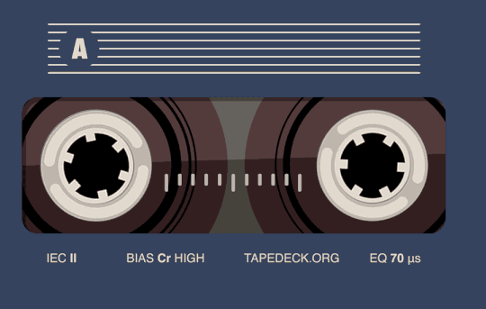

<section>
		
		

			

				<header class="major">
					<h3>Retail Demand Forecast</h3>
				</header>
				
 
				Analyzed approaches related to data preparation, analysis, and forecasting of time series, to facilitate recommending sales & marketing strategies based on trend/seasonality effects using data from Kaggle with diverse characteristics such as stationarity, seasonality, residuals, and sales data variance. Implemented and compared results using Exponential Smoothing Forecast, Auto Regressive Integrated Moving Average, Seasonal Auto Regressive Integrated Moving Average, Facebook’s Prophet, and LSTM Neural network. Tools: Python (pandas, scikit-learn, prophet, stats, math, TensorFlow, Keras). <b>Tech used: Stata, Exel   </b>

 
				<ul class="actions">
					<li><a target="_blank" rel="noopener noreferrer" href="https://github.com/infinitebhat/Retail-Demand-Forecast" class="button">Notebook-Project Report</a></li>
				</ul>	
<section>
		
		

			

				<header class="major">
					<h3>Regression Analysis of Tech Pulse Index</h3>
				</header>
				
<b> Course: Economic Data Analysis </b> 
				This project examines dynamics of High technology industries and its effect on economy of Silicon Valley, California, which includes overall employment rate, change in housing prices and consumer sentiment in geographical area of interest. Silicon Valley’s economy closely tied to tech industries growth which has effect on employment creation, more median income, better economic condition.

Additionally, this project examines technology industry trends as they relate to the recessions and explains more on 2000’s recession. Recessions had a negative impact on components of technology industries, negative growth in job creation in computer and electronic manufacturing. The tech bubble burst is a worst phase of American tech industries in early 2000s which badly affected the economy around Silicon Valley. The report examines growth in high technology and information industries and its innovations, and how it has helped in reducing overall unemployment rate, improving the overall economic conditions..<b>Tech used: Stata, Exel   </b>

<b> Project score: 98/100 </b> 
				<ul class="actions">
					<li><a target="_blank" rel="noopener noreferrer" href="https://drive.google.com/file/d/1S_o2Zs6OklnqMV0OK5avfav66o89WKjR/view?usp=sharing" class="button">Project Report</a></li>
					<li><a target="_blank" rel="noopener noreferrer" href="https://github.com/infinitebhat/Regression-Analysis-of-Tech-Pulse-Index" class="button">Learn more about code on github</a></li>
				</ul>	

<section>
		
		

			

				<header class="major">
					<h3> Classification of Audio Recordings Using Transfer Learning </h3>
				</header>
				
<b> Course: Fundamentals of Machine Learning </b> 
				This Project was part of Machine Learning Course. We investigate the performance of 3 pretrained architectures, and finetune and optimize the best performing architecture. We utilize an ensemble of 4 finetuned CNNs following the Densenet architecture which are pretrained on the Imagenet dataset. We demonstrate that audio recording samples falling into eight emotive categories may be classified with 85.5% accuracy.
				
<b>Tech used: Python, Excel</b>

				
<b> Special Notes: Given first place in class of 49 for classification accuracy. </b> 
				<ul class="actions">
					<li><a target="_blank" rel="noopener noreferrer" href="https://drive.google.com/file/d/1in5lEkZMR20LJftS_9lG3PifmEQfJYBb/view?usp=sharing" class="button">Project Report</a></li>
					<li><a target="_blank" rel="noopener noreferrer" href="https://github.com/infinitebhat/" class="button">Learn more</a></li>
				</ul>		
		<section>
		
		

			

				<header class="major">
					<h3>RFM Analysis for Customer Segmentation</h3>
				</header>
				This Project was part of KPMG virtual internship program hosted on theforage.com which enables Virtual Work Experience Programs from top consulting companies. Here I worked on the customer dataset to find the top 1000 customers who we should be targeting to enable sales revenues and most profit. Generative Algorithms like K-Means Clustering were used to cluster the customers based on their Recency, Frequency and Monetary Value of purchases with the company.
				
<b>Tech used: Python, Excel</b>

				<ul class="actions">
					<li><a target="_blank" rel="noopener noreferrer" href="https://github.com/infinitebhat/Customer-Segmentation-using-RFM-Analysis" class="button">Learn more</a></li>
				</ul>
			

	<section>
		
		

			

				<header class="major">
					<h3>Vehicle Routing Problem with Capacity constraints</h3>
				</header>
				
<b> Course Project: Operations Research </b> 
				The main aim of Vehicle routing problem is to optimize the routes of a fleet of homogeneous vehicles so as to serve all customer demand with minimum overall cost for the company. Here, vehicles should take routes such that  
					a) the time and cost of operation is should be minimized.
					b) each vehicle should visit customer only once.  
 Additionally, this project examines technology industry trends as they relate to the recessions and explains more on 2000’s recession. Recessions had a negative impact on components of technology industries, negative growth in job creation in computer and electronic manufacturing. The tech bubble burst is a worst phase of American tech industries in early 2000s which badly affected the economy around Silicon Valley. The report examines growth in high technology and information industries and its innovations, and how it has helped in reducing overall unemployment rate, improving the overall economic conditions..<b>Tech used: Python, Exel   </b>
				<ul class="actions">
					<li><a target="_blank" rel="noopener noreferrer" href="https://drive.google.com/file/d/1rg9NNyAdHoS3y4SlN9wgNVrI8BQbZoFO/view?usp=sharing" class="button">Project Report</a></li>
					<li><a target="_blank" rel="noopener noreferrer" href="https://github.com/infinitebhat/Vehicle-Routing-Problem" class="button">Learn more</a></li>
				</ul>	
	<section>
		
		

			

				<header class="major">
					<h3>Airport passenger departure system simulation</h3>
				</header>
				
<b> Course Project: Digital Simulation Technique </b> 
				A simulation of the airport passenger departure system was conducted by Arena, with a focus on four consecutive processes, including arrivals to check-in, luggage drop, security check, and departure. Several assumptions were made based on public reports and webpages regarding transportation. The objective was to optimize the allocation of at the lowest possible cost by minimizing the number of passengers who miss the flight due to delays in the airport. The optimal combination is 20 manual check-in counters and 12 security x-ray scanners at a total cost of 1775$, which reduces the total number of passengers missing the flight to zero. The difference between simulation and the real airport was discussed. <b>Software used: ARENA    </b>
				<ul class="actions">
					<li><a target="_blank" rel="noopener noreferrer" href="https://drive.google.com/file/d/1ofhFODmFfRAZ5473s4RIYWCegbdMfXom/view?usp=sharing" class="button">Project Report</a></li>
				</ul>	

<section>
		
		

			

